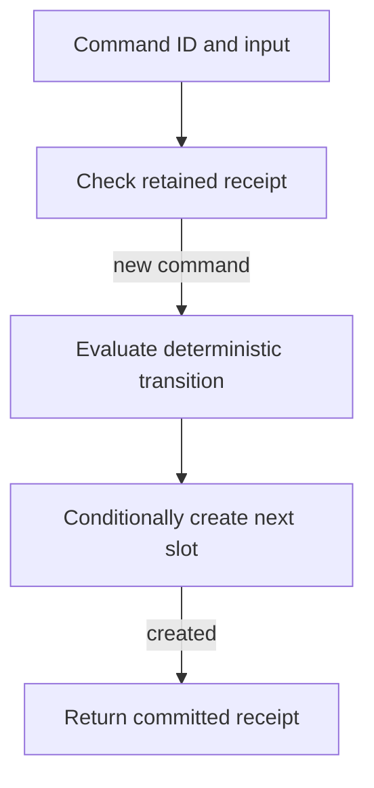
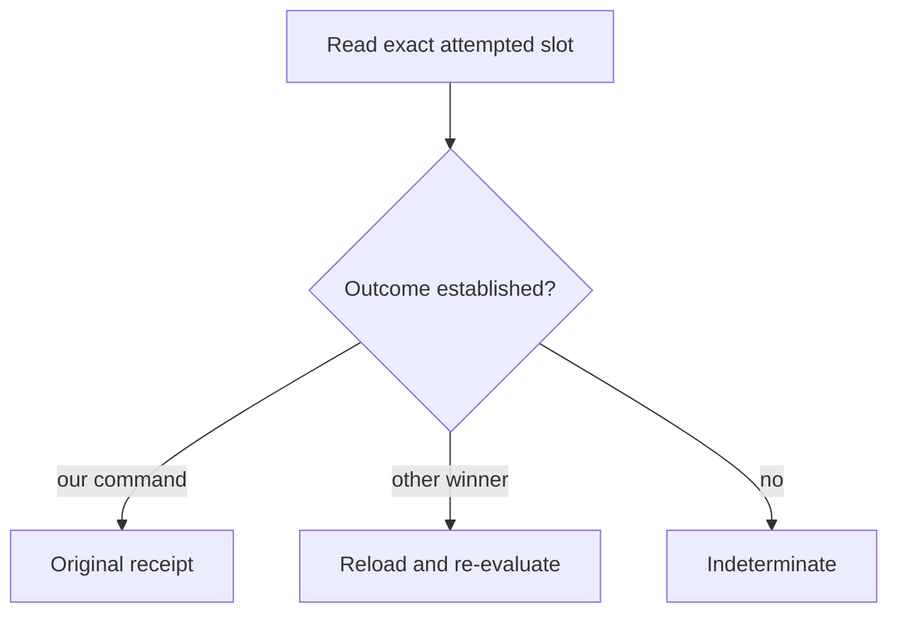

Two hosts can race to change the same partition. A local mutex cannot order their writes, and a timeout cannot tell either host whether its write reached storage. Generalist resolves both problems at the object boundary, using immutable numbered commit slots and stable command identities.

This chapter continues the [architecture overview](/learn/architecture).

## The commit path

1. **Read the committed prefix.** The engine reconstructs the partition from validated canonical records, using snapshots to bound replay. In-process materialization accelerates work but is not authority.
2. **Check the command receipt.** The command ID and input digest identify an exact retry. A matching retry returns the original receipt unchanged, including its original `duplicate` field. The same ID with different input fails rather than accepting a second meaning.
3. **Compute the next transition.** The deterministic reducer produces state patches and a receipt. The commit includes its sequence, parent digest, partition identity, command identity, patches, and receipt; the engine checks configured bounds before writing it.
4. **Create the next slot only if absent.** Successful conditional creation establishes that commit. A contender reads the winning record and can re-evaluate its deterministic transition against newer state, within the conflict retry limit. It never repeats a model or tool call to win a storage race.
5. **Resolve uncertain writes by evidence.** After a failed or conflicting create, the engine directly reads that exact slot. If the outcome cannot be established, it returns `DurabilityFailure` with `reason: "indeterminate"`. Preserve the original command ID and reconcile before external work; a fresh ID abandons the retry identity.

The provider must supply atomic absent-key creation, complete bytes, strong direct reads of acknowledged writes, and correct paginated listing. An S3-shaped API alone does not establish those properties. Generalist checks its own digests; an ETag is not a content hash. See [provider requirements](/features/durable-stores#provider-contract-and-support-limits).

### When creation is not acknowledged

The first path returns evidence of success; the second retries only the reducer within its configured bound. The third stops without another write attempt. In all three cases, the command keeps the same identity.

## Fencing orders replacement authority

An execution owner can pause, lose its lease, and resume after another owner takes over. Replacement ownership commits through the same partition protocol. Protected transitions check current Run-attempt and Session-writer authority, so an old owner cannot publish a late canonical result after replacement authority takes effect.

A clock timeout alone is not a fence. Nor can a fence retract a payment or model request already sent to a provider. The storage protocol orders Generalist state; [operation recovery](/learn/architecture-recovery#replay-does-not-mean-redispatch) handles what is known about the outside world.

## Bounds do not imply reclamation

Snapshots bound recovery work; they do not retire earlier commits or receipts. Recreating a deleted numbered slot could let a paused writer invalidate history, so bucket lifecycle expiration is unsafe for canonical objects. Retained history, immutable receipts, external outcomes, and incurred costs survive rewind.

The engine has bounded materialization, commit sizes, replay, and conflict retries. It is not an unbounded log service or an online garbage collector. Keep referenced blobs and workspace snapshots available too. Read [retention and backup](/features/durable-stores#snapshots-retention-and-garbage-collection) before operating a namespace.

Next: [Recovery and client truth](/learn/architecture-recovery).
