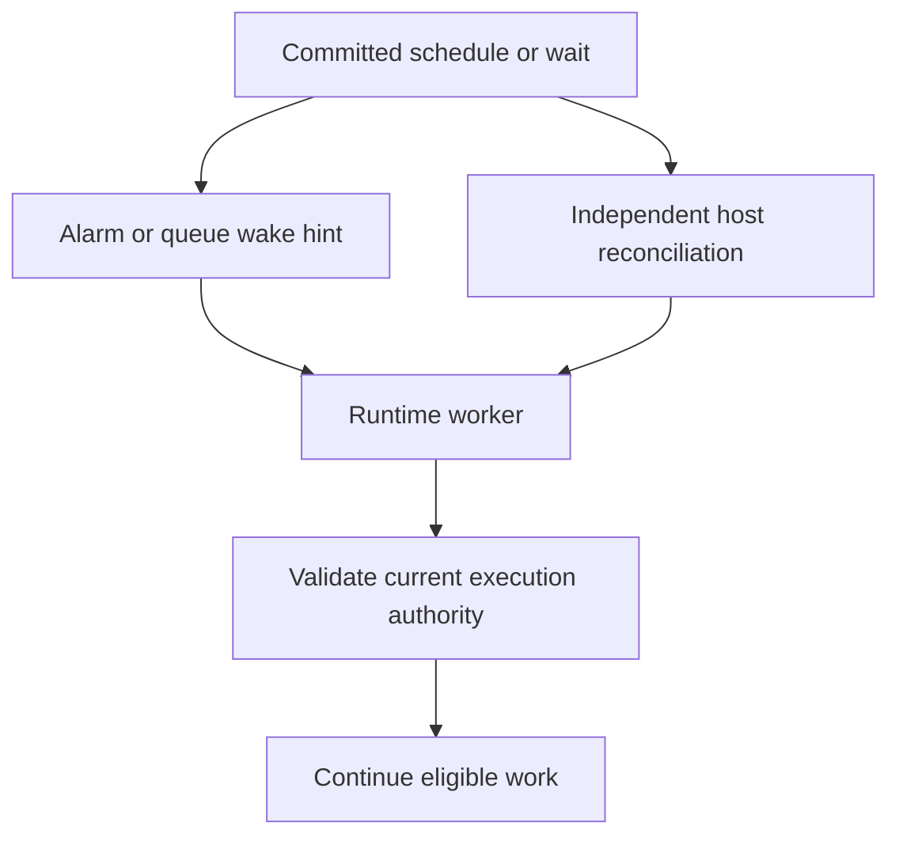
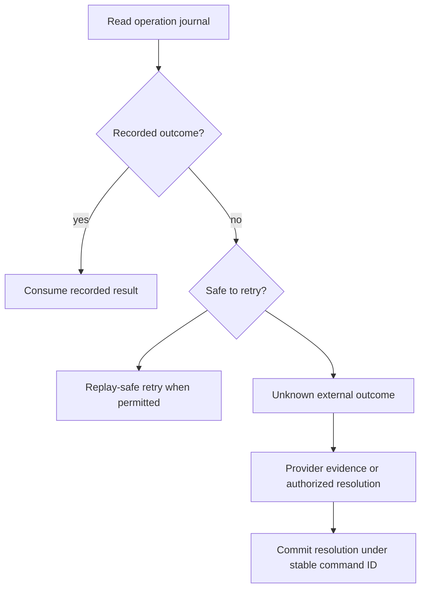
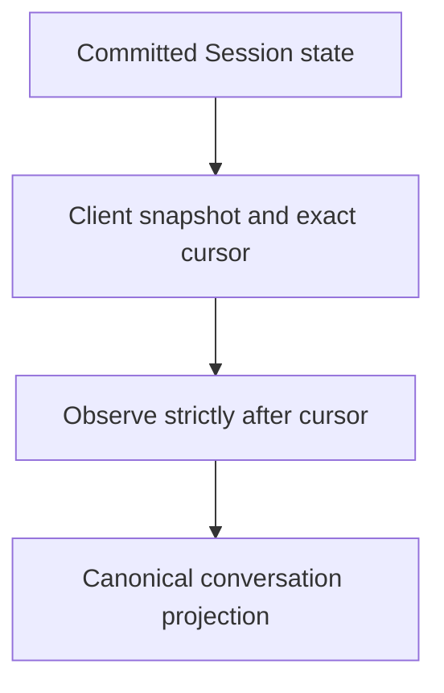
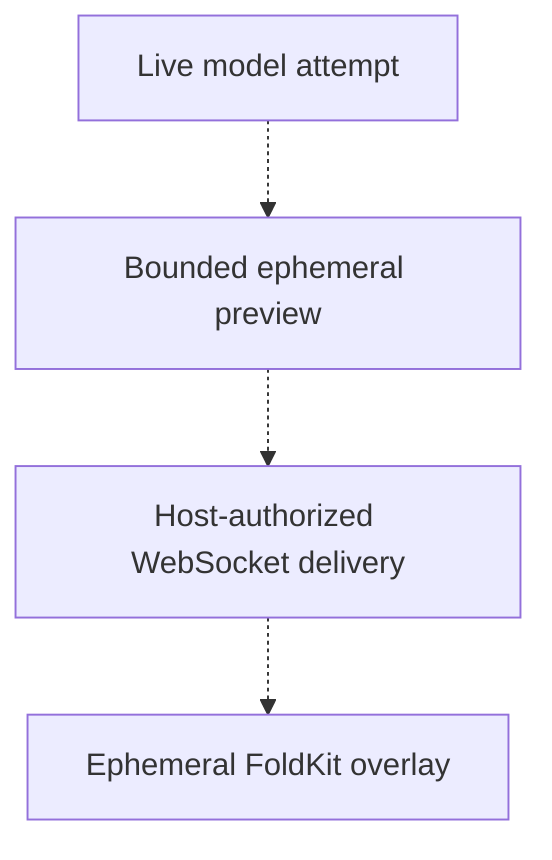

A committed command can survive while its wake notification or network connection disappears. Recovery must answer two questions: what work should run next, and what can a client safely display? Both answers start with canonical state, not the last message a process saw.

This chapter follows [the commit protocol](/learn/architecture-commits).

## A wakeup is a hint

An alarm succeeding does not prove a command committed; an alarm failing does not erase accepted work. Hosts need independent reconciliation so a crash between commit and wake delivery cannot strand a Run. Local scheduling needs a supervisor to restart failed processes. External scheduling must drain eligible work and arrange future wakeups, not just call the engine once.

Cloudflare and Rivet supply different lifecycle integrations over the same storage authority. Choose and operate the required [host capabilities](/features/hosts); object storage does not itself run a worker.

## Replay does not mean redispatch

Runtime records operation intent before dispatch and its outcome afterward. If the process disappears between those points, storage cannot prove whether an external effect happened. `pure`, `provider-idempotent`, and `never` replay policies preserve that distinction: an unknown non-idempotent effect must not be blindly dispatched again.

Strict replay consumes recorded outcomes from an authoritative cursor without redispatching them. Recovery of interrupted work is a separate decision: replay-safe operations may retry, while uncertain effects require evidence or an authorized operator's recorded resolution. No object transaction provides exactly-once payments, messages, or model requests.

Use [typed recovery and operator actions](/features/recovery) to inspect obligations and legal resolutions. A restarted worker also needs the original compatible executable registrations; substituting today's code under yesterday's identity is not recovery.

## Two snapshot meanings, two output lanes

A storage snapshot accelerates partition reconstruction. A **client Session snapshot** instead gives a bounded canonical projection: metadata, Runs, the active conversation path, and the exact durable cursor from which observation continues. It is not a backup or a second persistence model.

The WebSocket client loads a committed snapshot before delivering events for a replacement connection. Epochs distinguish connection attempts; cursors identify durable observation positions. Apply the snapshot before its following events, deduplicate already observed positions, and resynchronize through the client contract rather than inventing arithmetic continuity for filtered opaque cursors. Conversation updates can replace a suffix after a retained prefix: they are not just text appends.

Snapshot limits fail explicitly instead of silently truncating the conversation. See [the transport reference](/reference/transport) for snapshot fields, SSE behavior, and failures, and [FoldKit](/reference/foldkit) for the canonical UI projection. Closing observation does not cancel execution.

Live model previews show provisional text or reasoning before the semantic response commits. `Runtime.previews` provides bounded, lossy process-local frames. The Host checks current attempt authority before admitting `PreviewDelivery`; WebSocket carries this separate lane without advancing the durable cursor. SSE remains a canonical event stream.

FoldKit renders previews as an ephemeral overlay, not conversation entries. It checks the connection epoch, attempt authority, contiguous sequence, and UTF-16 offsets; a gap clears and tombstones the preview instead of guessing missing text. Snapshots and committed conversation updates remain canonical. Previews are not persisted or durably replayed, so losing every frame leaves execution and the eventual committed response unchanged.

Continue with [Core and Runtime](/learn/native-runtime#live-previews-are-outside-durability), [Session history](/learn/sessions-and-history), and [object durability](/features/durable-stores). Local qualification does not certify live providers or establish production performance.
