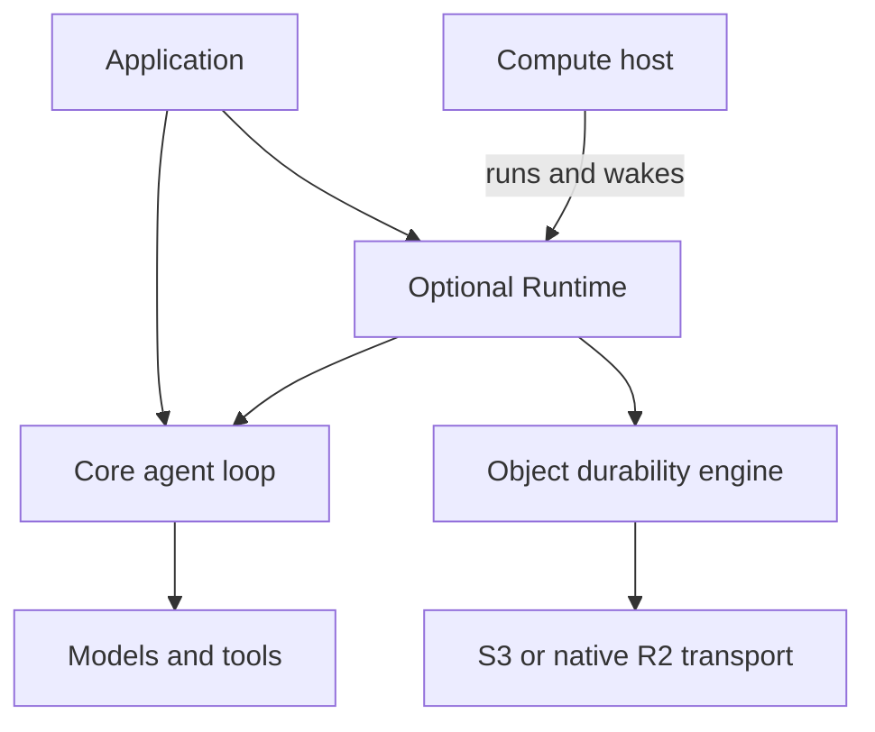
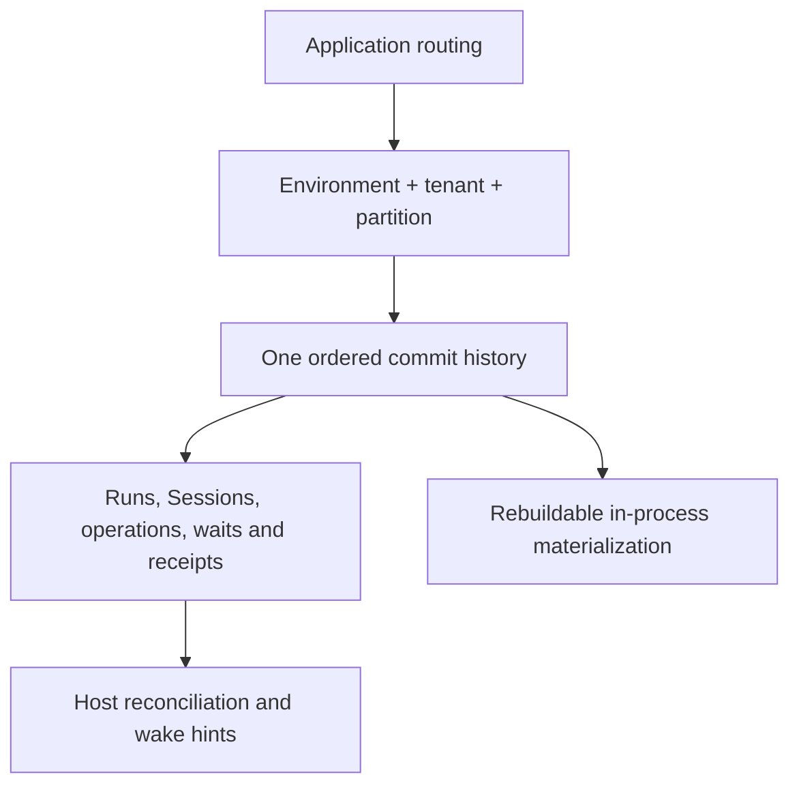

An agent can outlive the process that started it. Generalist separates the code that executes a turn from the state that proves which work was accepted, completed, or left uncertain. Start here to choose your application boundaries; the next two chapters follow a command into storage and back to a recovering client.

## Three boundaries, one optional durable engine

**Core executes the agent.** `generalist` composes Effect AI's `Prompt`, `Response`, `Tool`, and `Toolkit` with turns, policies, approvals, and typed events. It works without Runtime or storage. Streaming or logging its events does not give a process-local run crash recovery.

**Runtime owns durable execution.** It admits addressable Runs, records executable identities, journals operations, and owns Sessions, waits, budgets, and recovery. `generalist/durability` is its sole production durability engine; S3 and native R2 are transports for the same protocol. Recovery also needs the pinned executable resolver and application services: stored state is not stored executable code.

**The host supplies compute and lifecycle.** A local process, server, Cloudflare Durable Object, or Rivet actor runs the engine; it is not a replacement storage backend. The application supplies authentication, resource authorization, routing, credentials, and any required sandbox. Generalist does not infer tenant identity or provide a secure execution sandbox.

Read [Core and Runtime](/learn/native-runtime) for the package contract and [choose a host](/features/hosts) for supported lifecycle capabilities.

## Put authority in a partition

The partition is the serialization and atomicity boundary. Put related Runs, children, and Sessions together when a transition must update them atomically. Hosts can be replaced without changing this identity because local caches do not decide what committed.

Writes within a partition serialize, and the engine materializes state and receipts under configured byte and replay limits. Independent partitions do not imply automatic scaling: the application chooses routing and operates enough compute to service them. Generalist provides neither global transactions nor live partition reassignment. See [object durability](/features/durable-stores#authority-conflicts-and-fencing) before selecting partition sizes.

## A familiar storage/compute pattern, not the same system

Other systems make object storage part of their primary write path rather than merely archiving old data. These first-party descriptions explain the pattern, not Generalist's feature set:

| System                                                                     | What its architecture describes                                                                                                              | Where the analogy stops                                                                                                                               |
| -------------------------------------------------------------------------- | -------------------------------------------------------------------------------------------------------------------------------------------- | ----------------------------------------------------------------------------------------------------------------------------------------------------- |
| [turbopuffer](https://turbopuffer.com/docs/architecture)                   | A search database with namespace-scoped object storage and a WAL; memory and NVMe caches serve warm queries.                                 | It builds search indexes, not agent execution. Its cache design and published latency figures are not Generalist behavior or measurements.            |
| [WarpStream](https://docs.warpstream.com/warpstream/overview/architecture) | Kafka-compatible agents write an object-storage data plane, while a separate managed metadata store and control plane coordinate the system. | This is not Generalist's sole object-authority design. WarpStream's scaling and transaction guarantees do not transfer to Generalist.                 |
| [SlateDB](https://slatedb.io/docs/design/overview/)                        | An embedded LSM storage engine with WAL, MemTables, SSTables, and a manifest, writing durable data to object storage.                        | Generalist uses numbered command commits, not SlateDB's LSM implementation. This comparison describes its design overview, not proposed RFC features. |

Generalist does not adopt or integrate these systems. Separating recoverable data from replaceable compute establishes no cost, throughput, or benchmark equivalence. Generalist's live AWS/R2 behavior remains unqualified, and performance is not established by this architecture. [Local verification](/features/durability-verification) records the narrower evidence.

## Follow the state

1. [How a command commits](/learn/architecture-commits) explains immutable slots, retries, and fencing.
2. [Recovery and client truth](/learn/architecture-recovery) separates replay from redispatch, then follows snapshots and ephemeral previews to the UI.
